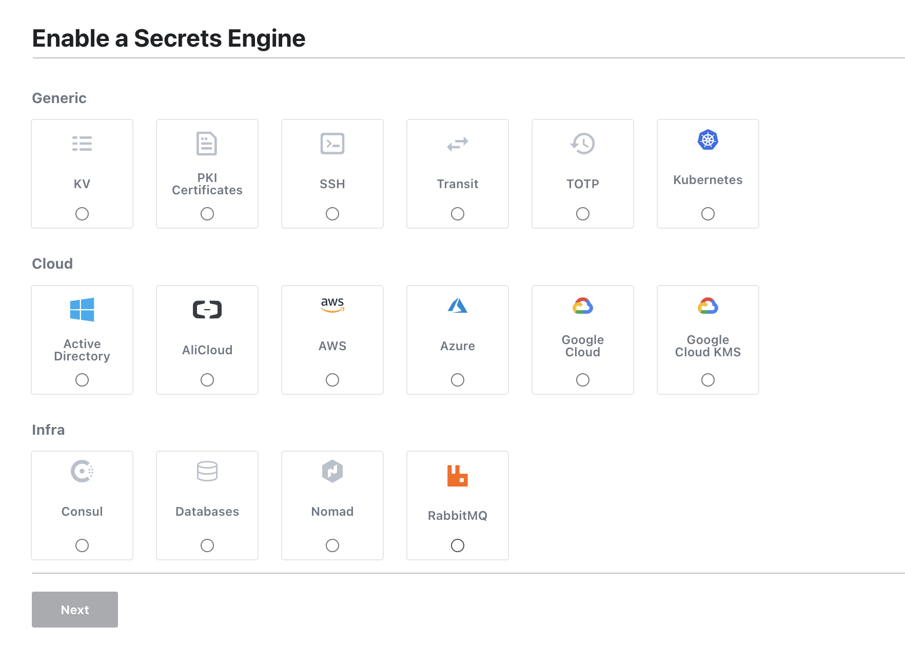
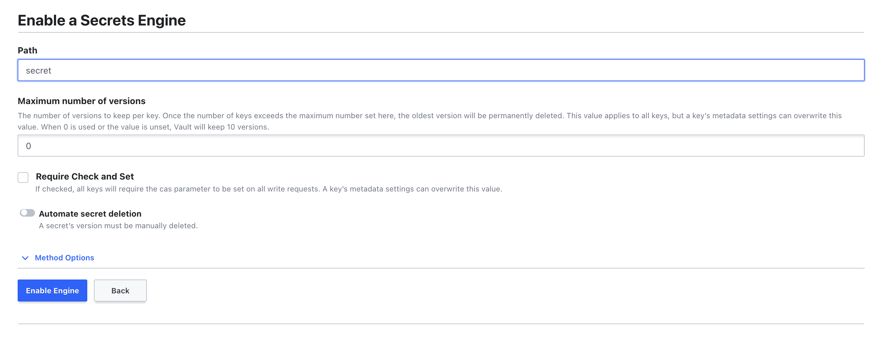
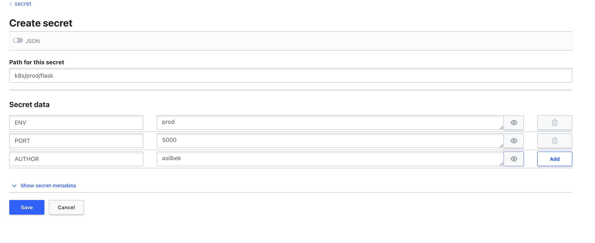

# Setup HashiCorp Vault
Create required folders

```bash
{
  sudo mkdir -p /vault/config
  sudo mkdir -p /vault/data
  sudo mkdir -p /vault/policies
}
```
Set env variables:
```bash
DB_NAME=vault
DB_PASSWORD=vaultSecretPassword
DB_USER=vault
DB_HOST=$(curl ifconfig.me)
DOMAIN_NAME=hashicorp-vault.asilbek.com
```
Create  vault/config/vault.hcl file. Change database creadentials
```bash
cat > /vault/config/vault.hcl <<EOF
# Full configuration options can be found at https://www.vaultproject.io/docs/configuration
ui = true
disable_mlock = true
disable_cache = true

storage "postgresql" {
  connection_url = "postgres://$DB_USER:$DB_PASSWORD@$DB_HOST:5432/$DB_NAME"
}

# HTTPS listener
listener "tcp" {
  address       = "0.0.0.0:8200"
  tls_disable   = 1
}

EOF

```
## Install required tools

```bash
{
    sudo apt update
    sudo apt-get install postgresql nginx certbot docker.io -y
}
```

## Setup Postgres
### Change user to postgres and run psql
```bash
su postgres
psql
```
### Database credentials must be same as in config/vault.hcl.
```bash
CREATE DATABASE vault;
CREATE USER vault WITH PASSWORD 'vaultSecretPassword';
ALTER ROLE vault SET client_encoding TO 'utf8';
ALTER ROLE vault SET default_transaction_isolation TO 'read committed';
ALTER ROLE vault SET timezone TO 'UTC';
GRANT ALL PRIVILEGES ON DATABASE vault TO vault;

```
Log out from postgres user and use vault user
```bash
 psql -U vault -d vault -h localhost
```
### Create database tables
```bash
CREATE TABLE vault_kv_store (
  parent_path TEXT COLLATE "C" NOT NULL,
  path        TEXT COLLATE "C",
  key         TEXT COLLATE "C",
  value       BYTEA,
  CONSTRAINT pkey PRIMARY KEY (path, key)
);

CREATE INDEX parent_path_idx ON vault_kv_store (parent_path);

CREATE TABLE vault_ha_locks (
  ha_key                                      TEXT COLLATE "C" NOT NULL,
  ha_identity                                 TEXT COLLATE "C" NOT NULL,
  ha_value                                    TEXT COLLATE "C",
  valid_until                                 TIMESTAMP WITH TIME ZONE NOT NULL,
  CONSTRAINT ha_key PRIMARY KEY (ha_key)
);
```

### Change database configs.
Find file path with 
```bash
sudo find / -name "postgresql.conf"
sudo find / -name pg_hba.conf
```
Change postgresql.conf file . Find  listen_addresses variable and set it to * </br>
listen_addresses = '*' </br>

Change pg_hba.conf file . Add this to the end of file
```bash
host    all             all              0.0.0.0/0              md5
host    all             all              ::/0                   md5
```

Restart postgres service
```bash
sudo systemctl restart postgresql
```
# Create vault unit file
```bash
cat > /etc/systemd/system/vault.service <<EOF 

[Unit]
Description=Docker Service for hashicorp vault
After=network.service docker.service
Requires=docker.service

[Service]
ExecStartPre=-/usr/bin/docker stop -t 60 vault
ExecStartPre=-/usr/bin/docker rm vault
ExecStart=/usr/bin/docker run \\
  --rm \\
  --name vault \\
  --publish 8200:8200 \\
  -v /vault/config:/vault/config \\
  -v /vault/policies:/vault/policies \\
  -v /vault/data:/vault/data \\
  --cap-add IPC_LOCK  \\
  -e VAULT_ADDR=http://0.0.0.0:8200 \\
  -e VAULT_API_ADDR=http://0.0.0.0:8200 \\
  -e VAULT_ADDRESS=http://0.0.0.0:8200 \\
  vault:1.13.3 \\
  vault server -config=/vault/config/vault.hcl
ExecStop=-/usr/bin/docker stop -t 60 vault

ExecReload=/usr/bin/docker restart 'vault'

Restart=always
RestartSec=20s

SuccessExitStatus=SIGKILL SIGTERM 143 137

[Install]
WantedBy=multi-user.target docker.service

EOF
```
## Run vault service
```bash
{
  sudo systemctl daemon-reload
  sudo systemctl enable vault
  sudo systemctl restart vault
}
```
Initialize vault and save output . 
```bash
docker exec -it vault vault operator init > secrets
```

## Setup Nginx. Use nginx_example file.
```bash
cat  > /etc/nginx/sites-available/vault <<EOF

upstream vault {
        server 127.0.0.1:8200 max_fails=0 fail_timeout=0;
}

server {
        server_name $DOMAIN_NAME;

        location / {
                proxy_pass http://vault;
                proxy_http_version 1.1;
                proxy_set_header Upgrade $http_upgrade;
                proxy_set_header Connection 'upgrade';
                proxy_set_header Host $host;
                proxy_cache_bypass $http_upgrade;
                client_max_body_size 0;
        }
        access_log /var/log/nginx/app-access.log;
        error_log /var/log/nginx/app-error.log;
}
EOF
```
Check nginx file. 
```bash
sudo nginx -t
sudo ln -s /etc/nginx/sites-available/* /etc/nginx/sites-enabled/

```
If everything is ok restart nginx serivce
```bash
sudo systemctl restart nginx
```

## Get ssl certificate with certbot
```bash
certbot
```

## Install vault agent on your kubernetes cluster

```bash
helm repo add hashicorp https://helm.releases.hashicorp.com

helm install vault hashicorp/vault --set="injector.enabled=true" --set=injector.externalVaultAddr=https://vault.asilbek.com -n vault --create-namespace
```

## Create Secret for service account on your cluster
```bash
cat > service_account_secret.yaml <<EOF 

apiVersion: v1
kind: Secret
metadata:
  name: vault-token-g955r
  namespace: vault
  annotations:
    kubernetes.io/service-account.name: vault
type: kubernetes.io/service-account-token

EOF

kubectl apply -f service_account_secret.yaml -n vault
```

## Configuration of vault

* Unseal vault with given keys
* Create Enable new engine with "secret" name.



* Choose KV  and name it secret

Create secret inside this engine
